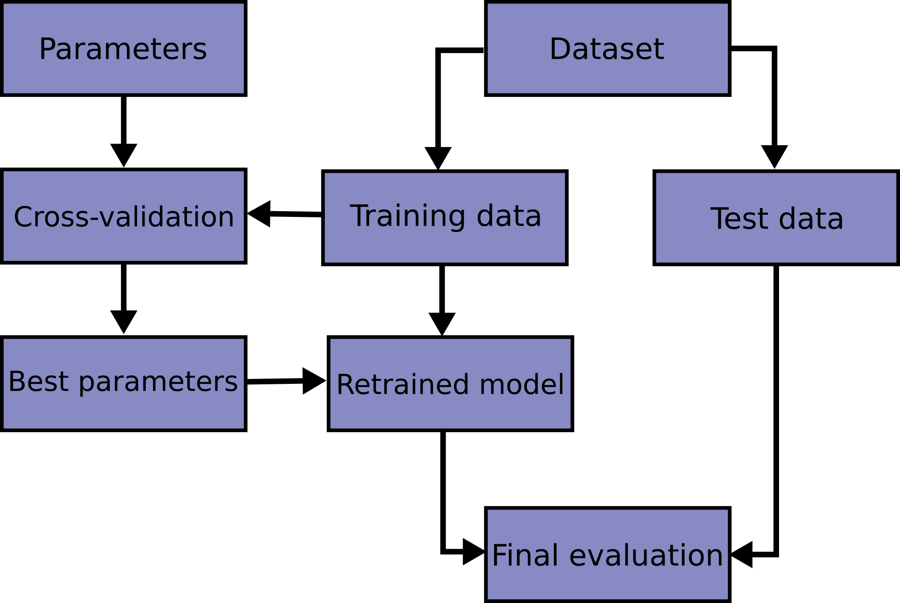

# Config streamlining
in the rl_project, we used:
* hydra - not sure what it does yet
* omegaconf (from omegaconf import DictConfig, OmegaConf)
* wandb for logging and plotting
proposed config structure:
model:
    n_hidden
    hidden_size # Perhaps replace with an array describing layers?
    batchNorm
    activation?other?
data: (does it need to be nested?)
    site(s)
    base_path
    nPoints
pipeline:
    modelMapping? default=softplus
    which pipeline?
    use Vmax?
train:
    lr
    epochs
    weight_decay
    batch_size
    loss?opt?iterator?

# ML Pipeline: validation, testing

This image is quite interesting, and probably what I'll try to do.

## Plan

* First, split the data into test/train.
* Then, perform cross validation + hp-tuing, with limited training steps (for computational cost), using k-fold
* Then, train the model with all of the train set, and the optimal parameters, with many training steps.
* Finally, evaluate the model using the test set.

## What functionality should we offer
* either we want to tune hyperparameters, and receive a set of optimal hp
* or we want, given specific set of hp, train a full model, then evaluate it
* or maybe we want to, given a set of hp, perform cross validation to evaluate it
* finally, we may want to perform everything in one go, find the optimal hp set, 
    train many epochswith it, and evaluate the resulting model

Config interface: flag hp_tuning_k_fold, flag train_evaluate. \
if the flag hp_tuning_k_fold is set, we expect hps to be given as array. \
For each combination (grid search), we perform k-fold for this set with the given k.\
perhaps, the k of k-fold can simply be 1 for no k-fold, and > 1 for k-fold-hp-tuning.\
if we receive just 1 hp for each array, this automatically means we evaluate a single set of hp.\
if hp_tuning_k_fold isn't set, we expect hps to be given as scalar numbers.\
if the flag train_evaluate is set, before doing any k-fold, we split the data into train-test.   \
then if k_fold is set, we do k_fold stuff with train. \
then, using optimal discovered hps if we did k-fold, or using given hps else, 
we do a large train with the train set, and evaluate it.

simpler version: \
hp_tuning tag. \
if it's true, expect hps to be array, and perform grid search + k-fold to find the best set, report it (print it).
if it's false, expect hps to be scalars, perform large training with them + eval on test set.

problem with this approach: can't guarantee the data used during hp-tuning won't intersect with the final test set.
hence, the hps might overfit this specific test set. 
Solution: either do stuff in one go, or find a deterministic way to split the data.

## List of HPs
* lr
* weight_decay
* batch size?
* nHidden, hidden_size?

-> let's start with the above 2.